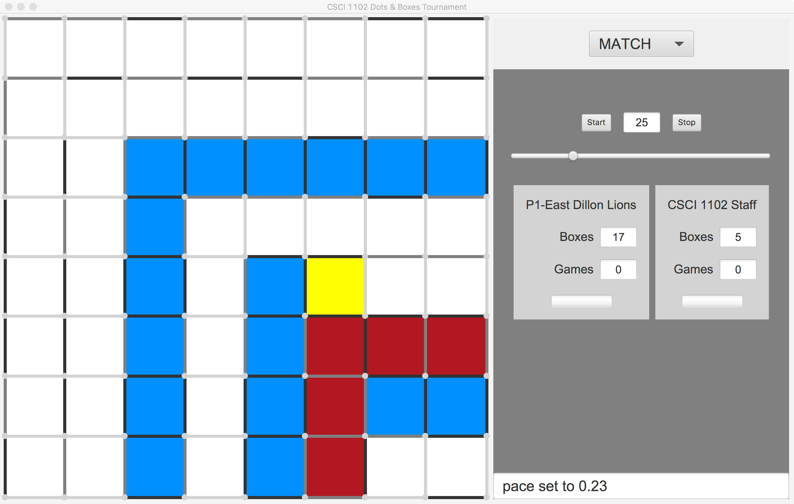

# CSCI 1102 Computer Science 2

### Spring 2018

**Instructors Meng & Muller**

**Boston College**

---

## Problem Set 10: Dots and Boxes

### 10 Points

#### Assigned: Sunday April 1, 2018

#### Due: Sunday April 29, 2018, Midnight

This is a pair problem set. If you don't have a partner in mind, you can use the partner finding tool on Piazza or you can ask a course staffer to help you find a partner. 

+ You should set about finding a partner today. 
+ **Please identify both team members in the comments at the top of your source files.**

---

In this problem set, you'll write a Java program that plays the game of [Dots and Boxes](https://en.wikipedia.org/wiki/Dots_and_Boxes) (also see [here](https://www.math.ucla.edu/~tom/Games/dots&boxes.html)).  Dots and Boxes is a two-player game in which the players attempt to capture squares on a 2D grid by marking line segments. Players alternate selecting line segments. If a player closes off a square by marking its 4th line, that player claims that square and gets to select another line.



The player that you write will compete against players written by other teams of students. In the above, the blue tiles denote squares that have been captured by player1, the `P1-East Dillon Lions`. The red tiles denote squares that have been captured by player2, the `CSCI 1102 Staff`. The yellow tile is just a visual aid denoting a square with 3 marked sides and which can be claimed by marking the line on the right (i.e., EAST).

#### The Tournament

Teams interested in participating can enter their player in the course tournament. If there are at least 32 teams participating, teams making it to the final 4 do not have to take the final exam. The winners will receive a full letter grade bump in their course grade (e.g., from a B to an A) while the second place finishers will receive a third of a letter-grade bump (e.g., from a B to a B+).

### The Code

The `src` directory contains the top-level program `DotsAndBoxes.java` and 5 subdirectories, each containing Java files implementing a java package of the same name.

```
DotsAndBoxes.java       controller/             ui/
board/                  players/                util/
```

+ The `board` package contains an implementation of the board and of square ADTs. Each of these has an API, discussed further below.
+ The `controller` package contains code that orchestrates the game. It implements 3 different modes: `INTERACTIVE`, `GAME` and `MATCH`. These are selected through the drop-down menu, upper right.
+ The `players` package contains code related to modular players. More on this below.
+ The `ui` package contains the graphical user interface;
+ The `util` package contains utilities, constants, tools etc.

The code works as distributed. You can compile it from the Unix command line using

```
> javac DotsAndBoxes.java
```

> NB: In order to compile and run the game your `CLASSPATH` environment variable must include at least the present directory `"."`. See a staffer if you need an assist with this.

Once compiled, the code can be executed from the Unix command line with:

```
> java DotsAndBoxes 8
```

The constant 8 specifies the board dimensions (all boards are square). Eight is actually the default size so it wasn't required. You may wish to play the game on a smaller board 3x3 or 4x4 or perhaps a larger board.

### Your Code

Your changes to the distributed code are restricted to the files in the `players/player1/` directory. In particular, you should *replace the existing file* `players/player1/Player1.java` *with your own version*. Your new `Player1.java` file must contain at least a public class named `Player1` that implements the following `Player` interface:

```java
package players;

import util.*;
import board.*;
import javafx.scene.paint.Color;

public interface Player {
  
  // The function makePlay accepts a board, the oppenent's most recent play and a long integer
  // representing the time remaining in milliseconds. The makePlay function will be called by 
  // the main app. It must return a Line that hasn't already been selected. If makePlay throws 
  // an exception or otherwise fails to return a valid Line within the allotted time remaining, 
  // the player loses the game.
  //
  Line makePlay(Board board, Line oppPlay, long timeRemaining);
    
  String teamName();      // 16 letters max
  String teamMembers();   // e.g., "Ziyuan Meng & Bob Muller"
  Color getSquareColor(); //see https://docs.oracle.com/javafx/2/api/javafx/scene/paint/Color.html
  Color getLineColor();
  int getId();
  String toString();
}
```

#### The Board

The main input to the `makePlay` function is a `Board`, one of the two ADTs defined in the `board` package.

```java
public interface Board {

  // The clone function returns a deep copy of the board. Since the result is
  // a Board, all of the operations specified in this API can be used on the
  // result. A player's makePlay function is given a clone of the board so
  // they can modify their copy of the board without affecting the official
  // board.
  //
  Board clone();

  // Get the square at the specified row and column.
  //
  Square getSquare(int row, int col);

  // The openLines functions returns the set of all open lines.
  // A legal line choice must be an element of this set.
  //
  Set<Line> openLines();

  // The squaresWithMarkedSides function returns the set of all squares
  // with n marked sides. The integer n should be in the range 0..4.
  //
  Set<Square> squaresWithMarkedSides(int n);

  // The markLine function marks a line for a give player and returns the
  // set of 0, 1 or 2 squares claimed. NB that markLine throws an exception
  // if the line is already marked. If markLine is called by player A and
  // an exception is thrown but not handled, then player A loses the game.
  //
  Set<Square> markLine(Player player, Line line);

  // Exports a deep copy of Board to 2D array of squares.
  //
  Square[][] toArray();
  boolean gameOver();
  Score getScore();
  String toString();
}
```

**NOTE:** When the tournament host offers your `makePlay` function the board to decide on a play, your player is *required* to return a Line *leaving the board in precisely the same state*. If it differs, your player loses.

#### Squares, Lines and Sides

The `Square` ADT is defined in the `board` package while the `Line` and `Side` ADTs are defined in the `util` package. A Board can be indexed by row and column indices to produce a Square. A Square has four Sides (`NORTH`, `WEST` `SOUTH` and `EAST`). 

A Line is just a *specification* of the position of a possibly marked line.  A Line has integers row and col specifying the position of a Square on the board as well as a Side specifying a side of a Square.

##### Sets & Iterators

Several of the operations in the Board ADT return a `Set`. The [Set ADT](https://docs.oracle.com/javase/7/docs/api/java/util/Set.html) is from Java's standard library. (The DotsAndBoxes program happens to use a `HashSet` as an implementation of the ADT but since it's an ADT, you don't have to worry about the implementation.) A common way to use a set in Java is through in [Iterator](https://docs.oracle.com/javase/7/docs/api/java/util/Iterator.html), another ADT from Java's standard library. If, e.g., `squares` is of type `Set<Square>`, the definition

```java
Iterator<Square> iterator = squares.iterator();
```

creates an abstraction that can work its way through the Squares in the set `squares`. The expression `iterator.hasNext()` will return `true` or `false` depending on whether or not there is another Square in the iterator and the expression `iterator.next()` will retrieve the next Square and remove it from the iterator. So successive calls to `next()` will work through the set of Squares.

### Getting Started

1. The first task is to clone this repo if you haven't done so already, stash it in a reasonable place on your computer. 
2. Find your teammate.
3. Sign your team up for the tournament if you wish to participate. You can find a sign up sheet [here](https://docs.google.com/spreadsheets/d/1zdbrgR6eO_hhVSew5Pc-iFs2L2BW8sJ0ivYG5zERCXA/edit#gid=0). I would like to emphasize that sign up should happen as soon as possible. **Those signing up with the lowest numbers are most likely to receive a bye in the tournament.** 
4. We suggest that you start playing the game a bit and start thinking about how you might implement your player. 

#### Strategy

The [UCLA website](https://www.math.ucla.edu/~tom/Games/dots&boxes.html) has some good ideas about strategy. One also might consider exploring the tree of possible games using the [minimax](https://en.wikipedia.org/wiki/Minimax) algorithm. Be mindful of the combinatorics. An 8 x 8 board has 144 sides. Then a minimax tree with a root with no moves made would have 144 children, each representing the selection of a given line. Each of these would have 143 children etc. Such a tree would have 144! leaves. This number is stupendously large, far, far exceeding the combined number of electrons and protons in the universe and a trillion computers executing a trillion instructions per second would require millions of trillions of years to produce an answer.

#### Working Under a Time Limit

The third input to the `makePlay` function is a long integer specifying how many milliseconds your player has to complete all of their selections in one game. If each player selected half the lines (which doesn't happen in practice) then your player would select 144 / 2 = 72 lines. Feel free to use the `Clock` ADT in the `util` package to manage the time used by your `makePlay` function.

#### Shakeout Period 

We plan to publish at least one more version of the game on April 14. The final version will have bug fixes and a few new features to support tournament play. In addition, teams are invited to submit API requests for additional features or changes to the API. If these requests seem reasonable and we have time to implement them before April 14, we'll implement them. API requests should be submitted through Piazza or via email. 


